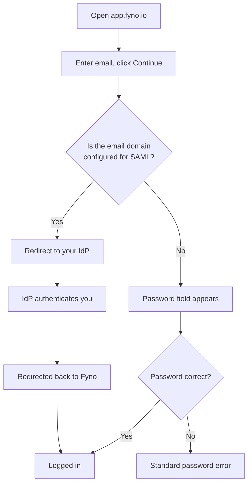

Single Sign-On (SSO) lets your team access Fyno using the identity provider your company already trusts. No separate usernames or passwords, and access is controlled from one place.

<CardGroup cols={2}>
  <Card title="SSO 2.0: email-first login" icon="sparkles" href="#sso-20-email-first-login">
    Enter your email on app.fyno.io and Fyno picks the right way to sign you in.
  </Card>
  <Card title="Set up SAML SSO" icon="key" href="#set-up-saml-sso">
    Connect Fyno to Okta, AWS, JumpCloud, Arcon, or any SAML 2.0 provider.
  </Card>
  <Card title="Provider guides" icon="book-open" href="#provider-specific-guides">
    Step-by-step setup for Okta, Arcon, and AWS.
  </Card>
  <Card title="Social login" icon="google" href="#social-login-google-microsoft">
    Sign in with Google or Microsoft without creating a Fyno password.
  </Card>
</CardGroup>

---

## SSO 2.0: email-first login

<Note>
SSO 2.0 is the standard login experience for **all** Fyno customers, whether or not they use SAML. The login page asks for your email first and works out the rest.
</Note>

### What changed

| | Before | With SSO 2.0 |
| --- | --- | --- |
| Login page | Email and password fields shown together | Email field only, then **Continue** |
| SAML users | Open your IdP console, find the Fyno tile, click it | Go straight to `app.fyno.io`, enter your email, get redirected to your IdP automatically |
| Non-SAML users | Enter email and password | Enter email, then the password field appears |
| Who decides the method | The user, by choosing a login button | Fyno, based on your email domain |

The goal is simple: **you should never need to know whether your organisation uses SAML.** Everyone starts at the same place and Fyno routes you correctly.

### How it works

<Steps>
  <Step title="Open app.fyno.io and enter your email">
    The login page shows a single **Email Address** field. Enter your work email and click **Continue**.
  </Step>
  <Step title="Fyno checks your email domain">
    Fyno looks up the domain (for example `example.com`) against the SAML configurations stored for your organisation.
  </Step>
  <Step title="You are routed to the right method">
    <Tabs>
      <Tab title="Domain has SAML configured">
        Fyno redirects you to your organisation's configured IdP login URL (for example JumpCloud or Okta). Your IdP authenticates you, sends you back to Fyno, and you are logged in. **You are never asked for a Fyno password.**
      </Tab>
      <Tab title="Domain has no SAML configured">
        The **Password** field appears beneath your email. Enter your password and click **Login**. An incorrect password shows the usual error message.
      </Tab>
    </Tabs>
  </Step>
</Steps>

### Login flow at a glance

### Routing examples

| You enter | Domain detected | SAML configured? | What happens |
| --- | --- | --- | --- |
| `user@acme.com` | `acme.com` | Yes | Redirected to Acme's IdP |
| `employee@acme.com` | `acme.com` | Yes | Redirected to Acme's IdP |
| `user@example.com` | `example.com` | No | Password field appears |

### Which account you end up in

<Warning>
For SAML users, the email you type on the Fyno login page is **only used to find your organisation's SAML configuration**. The account you are actually logged into is decided by the identity your IdP returns.
</Warning>

For example, if `acme.com` is configured for SAML and you type `alex@acme.com`, Fyno redirects you to Acme's IdP. If you are already signed in to that IdP as `sam@acme.com`, the IdP returns `sam@acme.com` to Fyno, and that is the Fyno account you land in.

In practice this is rarely noticeable, since people are normally signed in to their IdP as themselves. It matters when someone uses a shared machine or a colleague's IdP session.

### Is anything changing for existing SAML customers?

No action is needed. Your existing SAML configuration carries over; the difference is that your team can now start at `app.fyno.io` instead of locating the Fyno tile in your IdP console.

---

## Why organisations use SAML SSO

<AccordionGroup>
  <Accordion title="Grant access" icon="user-plus">
    Assign the Fyno application to a user or group in your IdP and they can log in straight away.
  </Accordion>
  <Accordion title="Just-in-Time (JIT) provisioning" icon="bolt">
    Users get a Fyno account automatically the first time they sign in through your IdP. There is nothing to pre-create on the Fyno side.
  </Accordion>
  <Accordion title="Revoke access" icon="user-minus">
    Remove the user from the Fyno app in your IdP, or deactivate them when they leave the organisation, and their access to Fyno is removed immediately.
  </Accordion>
</AccordionGroup>

| Benefit | What it means for you |
| --- | --- |
| No password sprawl | Nobody manages a separate Fyno username and password. |
| Centralised control | Access is granted and removed from your IdP, not inside Fyno. |
| Automated onboarding and offboarding | New joiners get access on first login; leavers lose it the moment they are removed. |
| Lower security risk | One authentication system to secure, monitor, and audit. |
| Easier audits | Login activity is visible in your IdP's existing audit trail. |

---

## Set up SAML SSO

<Info>
**Prerequisites**

- Admin access to your Identity Provider (IdP).
- Permission to download or copy your SAML **Signing Certificate** from the IdP.
</Info>

<Steps>
  <Step title="Get the signing certificate from your IdP">
    1. Open your IdP's **SAML application** or **SSO configuration** section.
    2. Locate the signing certificate. Depending on the provider it may be labelled:
       - X.509 Certificate
       - Public Certificate
       - SAML Certificate
       - Metadata
    3. Export or download it in **.xml** format.
  </Step>

  <Step title="Send the certificate to Fyno">
    Email the certificate file to **[support@fyno.io](mailto:support@fyno.io)**, along with the email domain(s) your users will sign in with (for example `acme.com`). Fyno uses these domains to route your users to your IdP during login.
  </Step>

  <Step title="Receive your configuration values">
    Fyno will reply with the values you need to complete setup on your side:

    | Value | Also known as |
    | --- | --- |
    | **ACS URL** | Assertion Consumer Service URL, Recipient URL, Destination URL |
    | **Audience** | Entity ID |
    | **Custom ID** | Generated by the Fyno team |

    <Warning>
    These values are unique to your organisation and environment. Do not reuse them across accounts.
    </Warning>
  </Step>

  <Step title="Configure your IdP">
    Enter the values from the previous step into your IdP's SAML app, then confirm:

    - `NameID` format is set to **Email Address**.
    - The user's **email** is sent as the primary identifier.
  </Step>

  <Step title="Test the login">
    Go to `app.fyno.io`, enter an email on your configured domain, and click **Continue**. You should be redirected to your IdP and, after authenticating, land in Fyno signed in.

    <Tip>
    Test with a user who has been explicitly assigned to the Fyno app in your IdP. If login fails, the most common causes are an incorrect `NameID` format or the user not being assigned to the app.
    </Tip>
  </Step>
</Steps>

<Note>
Need a hand at any step? Reach out at **[support@fyno.io](mailto:support@fyno.io)**.
</Note>

### Provider-specific guides

<CardGroup cols={3}>
  <Card title="Okta" href="./how-to-configure-okta-saml-single-sign-on-to-access-fyno">
    Configure Okta SAML SSO for Fyno.
  </Card>
  <Card title="Arcon" href="./how-to-configure-arcon-saml-single-sign-on-to-access-fyno">
    Configure Arcon SAML SSO for Fyno.
  </Card>
  <Card title="AWS" href="./how-to-configure-aws-saml-single-sign-on-to-access-fyno">
    Configure AWS SAML SSO for Fyno.
  </Card>
</CardGroup>

---

## Social login (Google, Microsoft)

Fyno also supports signing in with **Google** and **Microsoft** directly from the login page. This removes the need to create or remember a separate Fyno password and speeds up onboarding for teams that are not on a SAML IdP.

<Tip>
Social login and SAML SSO can coexist. Users on a SAML-configured domain are routed to their IdP; everyone else can use Google, Microsoft, or email and password.
</Tip>